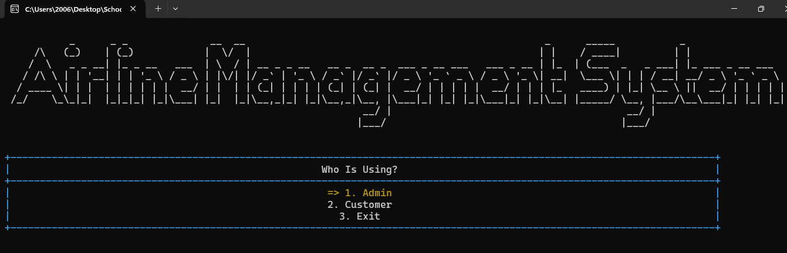
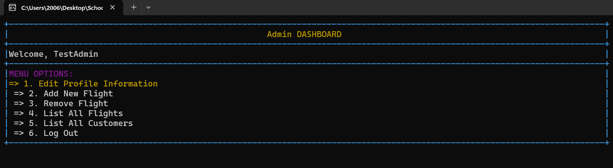
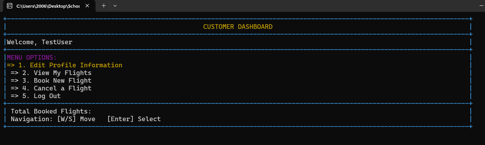
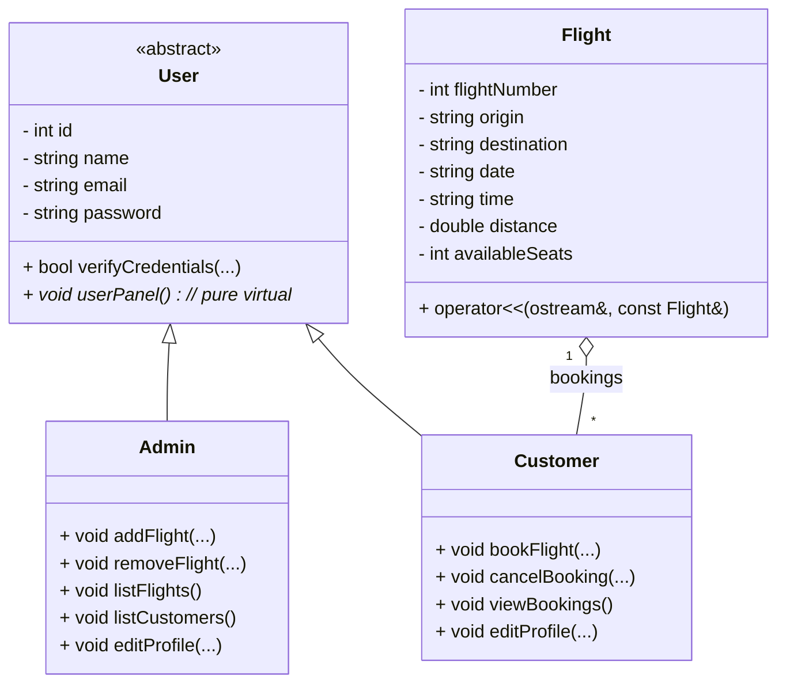

# ✈️ Airline Management System

A modern, console-based Airline Management System built in C++ as a semester project. It showcases solid Object-Oriented Programming (OOP) design with inheritance, polymorphism, and encapsulation, offering dedicated interfaces for administrators and customers to manage flights and bookings efficiently.

## 📸 Screenshots

<details>
  <summary><strong>Main Menu (click to view)</strong></summary>
  <p align="center">
    
  </p>
</details>

<details>
  <summary><strong>Admin Dashboard (click to view)</strong></summary>
  <p align="center">
    
  </p>
</details>

<details>
  <summary><strong>Customer Dashboard (click to view)</strong></summary>
  <p align="center">
    
  </p>
</details>


## 🔧 Technologies Used

- Language: C++
- Paradigm: Object-Oriented Programming (OOP)
- Key Concepts: Inheritance, Polymorphism, Abstraction, Encapsulation
- Interface: Console-based menu system with custom print utilities
- Storage: File handling (in progress)

---

## 🚀 Getting Started

### ✅ Prerequisites

- C++ compiler: g++ (MinGW on Windows), Clang, or MSVC
- Command-line interface: Terminal, CMD, or PowerShell

### 🛠️ Clone and Build

```bash
git clone https://github.com/Obaid03/AirlineManagementSystem.git
cd AirlineManagementSystem
# Minimal build (as used in this project)
g++ main.cpp User.cpp ConsoleManipulation.cpp Flight.cpp -o AirlineManagement.exe
g++ main.cpp User.cpp Admin.cpp Customer.cpp ConsoleManipulation.cpp Flight.cpp -std=c++17 -O2 -o AirlineManagement.exe
```

### ▶️ Run

```bash
# Windows
./AirlineManagement.exe

# Linux/macOS (if you build a non-.exe binary)
# ./airline_mgmt
```

Troubleshooting:
- If you see undefined references, ensure all corresponding .cpp files for declared headers are included in the compile command.
- Use -static on MinGW if needed to create a fully static binary: add -static at the end.

---

## 📌 Features

### 🛫 Admin Panel
- Add and remove flights
- View all flights with complete details
- View all registered customers
- Edit admin profile information

### 🧍 Customer Panel
- Book available flights
- Cancel existing bookings
- View personal profile and booking details
- Edit profile information

### ✈️ Flight Management
- Flight details include:
  - Flight Number
  - Origin and Destination
  - Date and Time
  - Distance
  - Available Seats
- Track customers booked on each flight
- Pretty printing via overloaded stream operator (operator<<)

---

## 🧱 System Architecture

### Class Diagram



### Hierarchy Overview

```
User (Abstract)
├── Admin
└── Customer

Flight (Independent)
```

---

## 📂 Project Structure

```
AirlineManagementSystem/
├── main.cpp                      # Entry point
├── User.cpp / User.h             # User base class (abstract)
├── Admin.cpp / Admin.h           # Admin class (optional if present)
├── Customer.cpp / Customer.h     # Customer class (optional if present)
├── Flight.cpp / Flight.h         # Flight class and printing utilities
├── ConsoleManipulation.cpp       # Console UI helpers and formatting
├── Other_Resources/
│   └── Screenshots/
│       ├── menu.png
│       ├── admin.png
│       └── customer.png
└── README.md
```

---

## 👨‍💻 Contributors

| Name | GitHub |
|------|--------|
| Hasnain | [@Hasnain848](https://github.com/Hasnain848) |
| Ibrahim | [@maybethemuhammadibrahim](https://github.com/maybethemuhammadibrahim) |
| Obaid | [@Obaid03](https://github.com/Obaid03) |

---

## 📝 License

This project is released under the MIT License. You are free to use, modify, and distribute for educational and personal purposes. See the LICENSE file for details (if present).

---

## 🙏 Acknowledgments

- Built as a semester project to practice core OOP concepts in C++
- Thanks to all contributors for their time and effort

---

## ⭐ Support

If you find this project helpful, please consider giving it a star. It helps others discover the repository and motivates continued improvements!
